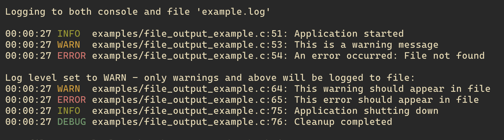

<!--------------------------------- HEADER --------------------------------->

<div align="center">

# 🔥 loggin.c

A simple logging library I built while learning C. It's got colors, multiple output options, and thread safety if you need it.

> **Heads up**: This is just something I'm playing around with. Don't use it in production or anything serious - it's more of a learning experiment than a real library.



</div>

<!--------------------------------------------------------------------------->

<!--------------------------------- FEATURES --------------------------------->

## What it does

- **Different log levels** - TRACE, DEBUG, INFO, WARN, ERROR, FATAL (you know, the usual suspects)
- **Output wherever you want** - console, files, or write your own output function
- **Thread safe** - if you're into that sort of thing
- **Colors!** - because who doesn't love colored terminal output
- **Customizable** - show/hide file names, line numbers, function names, whatever
- **Easy to use** - just include the header and start logging
- **No dependencies** - just standard C library stuff
- **Pretty fast** - I tried to keep it lightweight

<!--------------------------------------------------------------------------->

<!--------------------------------- VISUAL EXAMPLE --------------------------------->

## What it looks like

Here's what the output actually looks like when you run it:

```
Logging to both console and file 'example.log'

00:00:27 INFO  examples/file_output_example.c:51: Application started
00:00:27 WARN  examples/file_output_example.c:53: This is a warning message
00:00:27 ERROR examples/file_output_example.c:54: An error occurred: File not found

Log level set to WARN - only warnings and above will be logged to file:

00:00:27 WARN  examples/file_output_example.c:64: This warning should appear in file
00:00:27 ERROR examples/file_output_example.c:65: This error should appear in file
00:00:27 INFO  examples/file_output_example.c:75: Application shutting down
00:00:27 DEBUG examples/file_output_example.c:76: Cleanup completed
```

*The colors look way better in an actual terminal, trust me.*

<!--------------------------------------------------------------------------->

<!--------------------------------- QUICK START --------------------------------->

## Getting started

### Basic usage

```c
#include "lib/loggin.h"

int main(void) {
    logger_init();
    
    log_info("Application started");
    log_debug("Debug value: %d", 42);
    log_warn("This is a warning");
    log_error("An error occurred: %s", "File not found");
    
    logger_cleanup();
    return 0;
}
```

You'll get output that looks like this:
```
14:30:25 INFO  main.c:42: Application started
14:30:25 WARN  main.c:45: This is a warning
14:30:25 ERROR main.c:48: An error occurred: File not found
```

### Building and running

```bash
# Build everything
make

# Try the examples
make run-basic      # Basic stuff
make run-file       # File output
make run-advanced   # Fancy features

# Or just run them all
make run-all

# Clean up when you're done
make clean
```

<!--------------------------------------------------------------------------->

<!--------------------------------- API REFERENCE --------------------------------->

## API stuff

### Initialization

```c
void logger_init(void);           // Initialize logger with defaults
void logger_cleanup(void);        // Cleanup resources
```

### Configuration

```c
void logger_set_level(log_level_t level);        // Set minimum log level
void logger_set_quiet(bool quiet);               // Enable/disable output
void logger_set_colors(bool use_colors);         // Enable/disable colors
void logger_set_show_file_line(bool show);       // Show file:line info
void logger_set_show_function(bool show);        // Show function names
void logger_set_lock(log_lock_fn_t fn, void *data); // Set thread lock function
```

### Output Management

```c
int logger_add_console_output(log_level_t level);                    // Add console output
int logger_add_file_output(FILE *file, log_level_t level);           // Add file output
int logger_add_custom_output(log_output_fn_t fn, void *data, log_level_t level); // Add custom output
```

### Logging Macros

```c
log_trace(...);   // TRACE level
log_debug(...);   // DEBUG level
log_info(...);    // INFO level
log_warn(...);    // WARN level
log_error(...);   // ERROR level
log_fatal(...);   // FATAL level
```

### Utility Functions

```c
const char* logger_level_to_string(log_level_t level);
log_level_t logger_string_to_level(const char *str);
```

<!--------------------------------------------------------------------------->

<!--------------------------------- EXAMPLES --------------------------------->

## Examples

### File Output

```c
#include "lib/loggin.h"

int main(void) {
    logger_init();
    
    FILE *log_file = fopen("app.log", "w");
    logger_add_file_output(log_file, LOG_LEVEL_INFO);
    
    log_info("This will be written to app.log");
    log_debug("This won't appear (level too low)");
    
    fclose(log_file);
    logger_cleanup();
    return 0;
}
```

This will write to your app.log file:
```
2024-01-15 14:30:25 INFO  main.c:42: This will be written to app.log
```

### Custom Output Function

```c
void my_custom_output(log_event_t *event) {
    // Custom formatting logic here
    printf("CUSTOM: %s\n", event->fmt);
}

int main(void) {
    logger_init();
    logger_add_custom_output(my_custom_output, NULL, LOG_LEVEL_TRACE);
    
    log_info("This uses custom formatting");
    logger_cleanup();
    return 0;
}
```

You'll see:
```
CUSTOM: This uses custom formatting
```

### Thread Safety

```c
#include <pthread.h>

static pthread_mutex_t logger_mutex = PTHREAD_MUTEX_INITIALIZER;

void thread_lock(bool lock, void *data) {
    if (lock) {
        pthread_mutex_lock(&logger_mutex);
    } else {
        pthread_mutex_unlock(&logger_mutex);
    }
}

int main(void) {
    logger_init();
    logger_set_lock(thread_lock, NULL);
    
    // Now logging is thread-safe
    log_info("Thread-safe logging");
    
    logger_cleanup();
    return 0;
}
```

<!--------------------------------------------------------------------------->

<!--------------------------------- LOG LEVELS --------------------------------->

## Log levels

| Level | Value | Description | Color |
|-------|-------|-------------|-------|
| TRACE | 0     | Detailed trace information | 🔵 Blue |
| DEBUG | 1     | Debug information | 🔷 Cyan |
| INFO  | 2     | General information | 🟢 Green |
| WARN  | 3     | Warning messages | 🟡 Yellow |
| ERROR | 4     | Error messages | 🔴 Red |
| FATAL | 5     | Fatal error messages | 🟣 Magenta |

<!--------------------------------------------------------------------------->

<!--------------------------------- OUTPUT FORMAT --------------------------------->

## Output format

### Console Output (with colors)
```
14:30:25 INFO  main.c:42: Application started
14:30:25 WARN  main.c:45: This is a warning
14:30:25 ERROR main.c:48: An error occurred
```

### File Output
```
2024-01-15 14:30:25 INFO  main.c:42: Application started
2024-01-15 14:30:25 WARN  main.c:45: This is a warning
2024-01-15 14:30:25 ERROR main.c:48: An error occurred
```

<!--------------------------------------------------------------------------->

<!--------------------------------- INSTALLATION --------------------------------->

## Installation

### Local Build
```bash
make
```

### System Installation
```bash
make install  # Requires sudo
```

### Uninstall
```bash
make uninstall  # Requires sudo
```

<!--------------------------------------------------------------------------->

<!--------------------------------- PROJECT STRUCTURE --------------------------------->

## Project structure

```
lib/                          # Root directory for all library code
├── logger.h                  # Main entry point for the logger module
├── logger/                   # Logger-specific directory
│   ├── logger.c              # Core logger implementation
│   ├── logger.test.c         # Logger tests
│   └── utils/                # Specialized utilities
│       ├── console/          # Console output utilities
│       ├── file/             # File output utilities
│       └── threading/        # Threading utilities
```

<!--------------------------------------------------------------------------->

<!--------------------------------- FOOTER --------------------------------->

<div align="center">

---

**Developed with ❤️ by [Sebastian Rivera](https://github.com/ItsCbass)**

*Following the Maysara Code Style: "Code as Art, Structure as Poetry"*

[](https://github.com/ItsCbass/loggin.c)
[](LICENSE)

---

### Code style

I tried to follow the **Maysara Code Style** guidelines for this project. It's a pretty cool approach to writing code that's both functional and nice to look at.

**Check it out:** [https://github.com/maysara-elshewehy/MCS](https://github.com/maysara-elshewehy/MCS)

The whole "Code as Art, Structure as Poetry" thing really resonated with me - why should code be ugly when it can be beautiful?

</div>

<!--------------------------------------------------------------------------->